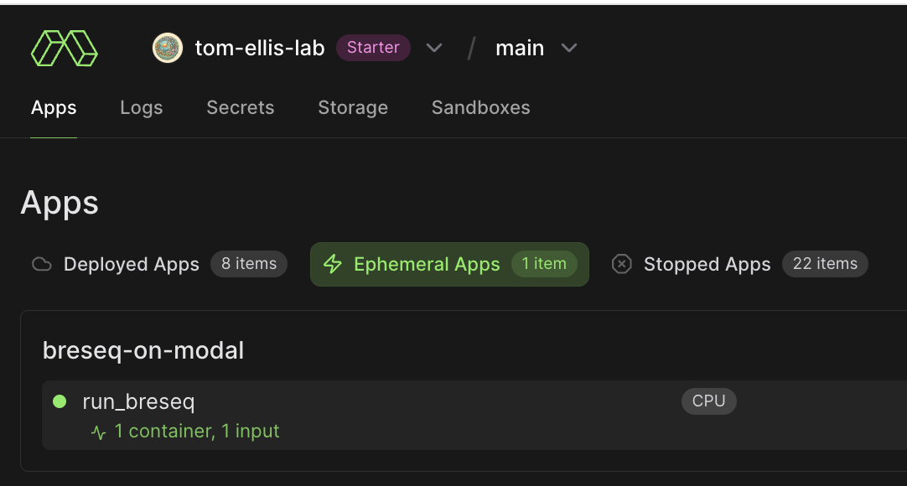
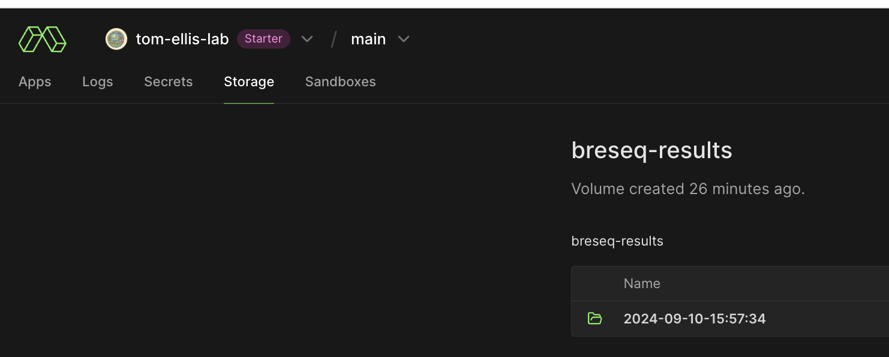

# ☁️ Cloud-based breseq
Runs breseq in the cloud, no fast computer necessary.

*Hint:* Whenver text is written like `this`, or
```
like this
```
it means that you should run this code in the terminal. Make sure that it's a unix terminal which means if you are on windows you have to install WSL first (see below).

## How to run breseq

### Prerequisites
- For Windows Users: [WSL installed](https://learn.microsoft.com/en-us/windows/wsl/install)
- Python (and pip which comes with installing python) installed.

*Hint:* For windows users, make sure to first install WSL, then [install Python on the WSL](https://learn.microsoft.com/en-us/windows/python/web-frameworks#install-python-pip-and-venv).

### 1. Log in to modal
1. Sign up to [modal.com](https://modal.com/signup)
2. Follow the modal quickstart guide by entering the following the code in a new terminal: 
    ```
    pip install modal
    python3 -m modal setup
    ```
    If you are on windows, make sure this is a WSL terminal and not PowerShell.
### 2. Repository and file setup
3. Clone this repository to your computer (i.e copy the files from here to your local computer). To do so, type this into your terminal: `git clone https://github.com/tdsone/breseq-on-modal.git`
4. Place your fastq and reference files (zipped else the upload will take longer) into the `breseq` folder. Do not include any other files as all files in the `breseq` folder will be uploaded - more files increase the upload time. On windows, the `breseq-on-modal` folder which you downloaded in Step 3 will most likely be located in a location like `C/Users/<your username>/breseq-on-modal`. Your folder structure should look like this after placing the files:
    ```
    .
    ├── README.md
    ├── breseq
    │   ├── E. coli_W3110_genome_and_annotations.gbk
    │   ├── NG-33079_ANT_5_lib688184_10218_3_1.fastq.gz
    │   ├── NG-33079_ANT_5_lib688184_10218_3_2.fastq.gz
    │   ├── __init__.py
    │   ├── __pycache__
    │   │   ├── __init__.cpython-310.pyc
    │   │   └── main.cpython-310.pyc
    │   ├── config.json
    │   ├── main.py
    │   └── requirements.txt
    └── image.png
    ```
6. Open `config.json` in VS Code or any other text editor which is located in the `breseq` folder to correctly name the fastq and reference sequence.
### 3. Running breseq and retrieving results
6. Open a terminal and make sure you are in the root folder of this repository. To check if you are in the right folder, run `pwd`. This should show `<blablabla>/breseq-on-modal` but e.g. not `<blablabla>/breseq-on-modal/breseq`.
7. Now, in your terminal, run `modal run --detach breseq.main` to run breseq. This will take a while (up to an hour). It will first set everything up (only once), then upload the files (every time you run modal), then run breseq. After the files have been uploaded, it should be fine to close your terminal and go home - breseq runs in the cloud ;)
8. You can always check the status of the run in the ephemeral apps tab: 
    
9.  Once it's done, you have to download the files. Type this in your terminal `modal volume get breseq-results <your folder>`. This will also be among the last few messages in the logs and is the time at which you started the breseq run. If in doubt you can see all your runs in the storage tab of modal: `https://modal.com/storage/<your username>/main/breseq-results`.
    

# How much does it cost? 
As of 10.09.2024, modal comes with 30$ for free per user per month. One full breseq run costs ~3-5$, so you can run breseq 6-10 times per month per user. You can also apply for academic credits which is 500$ once. 

# Need support?
Whatever comes up, I'm happy to help: please open an issue https://github.com/tdsone/breseq-on-modal/issues and leave your email. I will reach out to you within a day to help.
